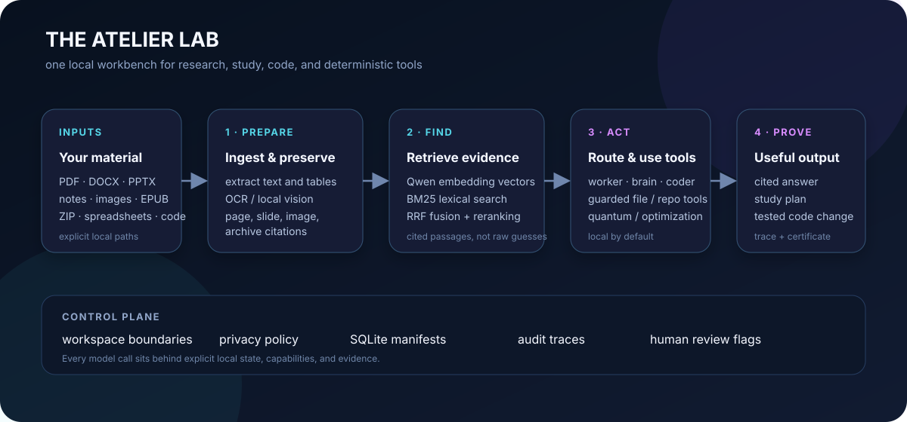
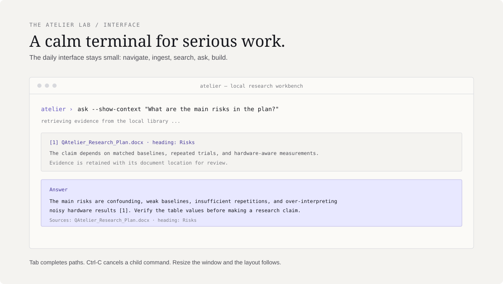
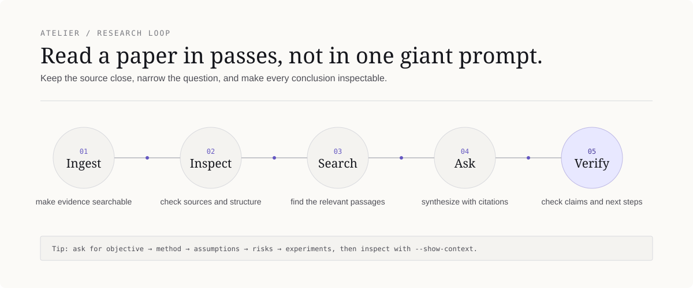
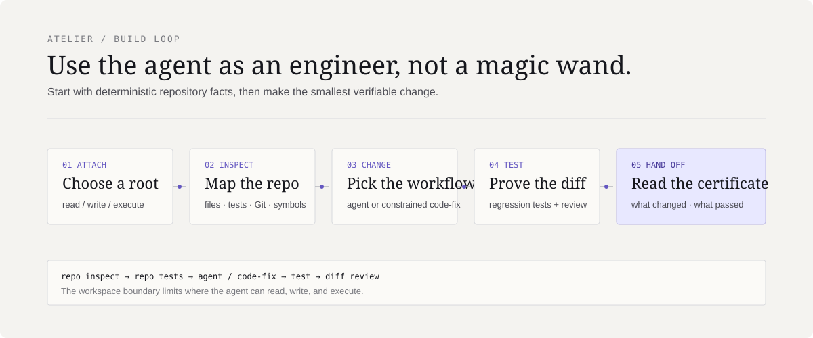
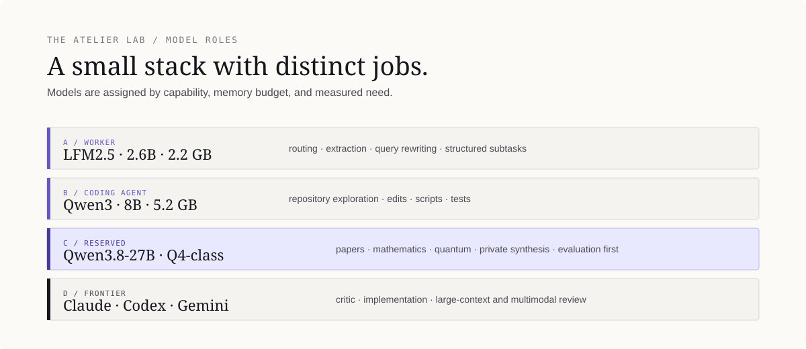

# The Atelier Lab

**A local-first research workbench for reading papers, asking grounded questions, writing code, and exploring quantum computing.**

> How much reliable AI capability can one researcher obtain from local models under fixed memory, latency, privacy, and compute constraints?

Atelier is the operational center of The Atelier Lab. It gives one terminal interface to a local document library, hybrid retrieval, model routing, guarded repository tools, deterministic scientific tools, durable memory, and verification. The default path is deliberately small:

```text
ingest → search / ask → agent or code-fix → verify
```



The project also contains a structured learning track for implementing language models from first principles and a reproducible experiment registry for Apple Silicon, local inference, agents, retrieval, and training.

## What Atelier does

| Capability | What it provides |
|---|---|
| Knowledge mode | Ingest and question papers, DOCX, PPTX, spreadsheets, notes, images, EPUBs, archives, and source code |
| Research mode | Page-aware extraction, semantic + lexical retrieval, citations, paper characterization, visual evidence, and research planning |
| Build mode | Repository inspection, guarded edits, tests, diff review, and a verification certificate |
| Scientific tools | Deterministic quantum-circuit inspection/simulation and optimization validation |
| Memory | Local semantic memory, explicit project memory, workflow checkpoints, traces, and audit logs |
| Interfaces | Responsive terminal CLI, optional loopback web UI, and MCP bridge for compatible external hosts |

Atelier is not intended to replace human judgment in research. Retrieval provides evidence; the user decides whether that evidence is correct, current, and sufficient.

## The interface

The normal entry point is now available from any directory on the Mac:

```bash
atelier
```

The interactive prompt accepts Atelier commands and familiar terminal navigation. `cd` changes the active workspace, `ls`, `find`, `rg`, `git`, and `cat` work inside the session, and `Tab` completes commands and nested filesystem paths. The display refreshes to the current Terminal width, including after maximizing or resizing the window.



Typical session:

```text
atelier › cd ~/Downloads
atelier › ingest QAtelier_Quantum_Adapters_Research_Plan.docx
atelier › search "falsifiers and hardware validation"
atelier › ask --show-context "What evidence is required before claiming quantum advantage?"
atelier › exit
```

Use `help` for the daily commands and `advanced-help` only when you need services, evaluation, research, quantum, optimization, or workflow commands. `Ctrl-C` cancels a child operation and leaves the Atelier prompt open; `exit` closes the session.

## Quick start

### Use the installed launcher

```bash
atelier doctor
atelier models status
atelier
```

The launcher uses the project’s editable virtual environment, so normal use does not require activating a venv. User documents and runtime state are stored outside the repository under `~/Atelier`.

### Install from a fresh checkout

```bash
git clone https://github.com/MonitSharma/The-Atelier-Lab.git
cd The-Atelier-Lab
uv venv atelier_agent/.venv
uv pip install -r atelier_agent/requirements.txt
uv pip install -e atelier_agent
atelier doctor
```

For development checks:

```bash
make -C atelier_agent test
python3 scripts/check_repo.py
python3 scripts/validate_experiments.py
```

## How to use Atelier

### The basic mental model

Atelier has two ways to work:

1. **Interactive session** — run `atelier` once, then navigate, ingest files, ask questions, inspect repositories, and leave with `exit`.
2. **One-shot commands** — run a single command directly from a normal terminal, useful for scripts, repeatable checks, and explicit workspace paths.

Both surfaces use the same local runtime, model configuration, vector index, memory, and workspace rules.

### Your first ten minutes

```bash
# 1. Confirm the runtime, models, index, and workspace state.
atelier doctor
atelier models status

# 2. Start the persistent prompt.
atelier
```

Inside the prompt:

```text
atelier › pwd                         # where the session is working
atelier › ls                          # see the current directory
atelier › cd ~/Documents/papers       # move to a research folder
atelier › ingest .                    # index supported material below it
atelier › sources                     # confirm what is indexed
atelier › search "your topic"        # inspect evidence first
atelier › ask --show-context "..."    # ask a grounded question
```

The index is stored under `~/Atelier`, while the original files remain where they are. Ingestion does not modify or upload the source material. If a file was indexed before an extraction upgrade, use `ingest --force PATH` to regenerate its chunks and metadata.

### Which command should I use?

| If you want to... | Use | Why |
|---|---|---|
| Add documents or code to the local library | `atelier ingest PATH` | Extracts supported material and creates searchable chunks |
| Check whether ingestion worked | `atelier sources` | Lists indexed sources and their paths |
| See the evidence without synthesis | `atelier search "QUERY"` | Shows retrieved passages without asking a model to answer |
| Ask a grounded research question | `atelier ask "QUESTION"` | Retrieves local evidence, reasons over it, and cites sources |
| Inspect a paper as a structured artifact | `atelier paper FILE.pdf` | Creates a cached characterization before deeper reading |
| Ask for a repository task | `atelier agent "TASK"` | Flexible inspect → tool → reason workflow |
| Make a constrained code change | `atelier code-fix "TASK"` | Guarded edit → tests → diff certificate workflow |
| Save an explicit preference or project fact | `atelier remember "FACT"` | Stores durable local memory only when you request it |
| See the system state | `atelier doctor` | Checks runtime, models, index, memory, and workspaces |
| Expose the optional local browser/API surface | `atelier serve` | Starts the loopback service; not needed for normal CLI use |

### Working with paths and workspaces

Atelier starts in the directory from which it was launched. Inside the prompt, use normal navigation:

```text
atelier › cd ~/code_projects/my-project
atelier › pwd
atelier › repo inspect .
```

For a one-shot command, make the root explicit:

```bash
atelier --workspace ~/code_projects/my-project repo inspect .
atelier --workspace ~/Documents/papers ingest .
atelier --workspace ~/code_projects/my-project code-fix \
  "Add a regression test for the parser" --path . --no-escalate --json
```

The inspection and ingestion examples need only automatic `read` access. For
the editing and test-running example, approve the repository once first:

```bash
atelier workspace add ~/code_projects/my-project \
  --name my-project --capabilities read,write,execute
atelier workspace open my-project
```

If Atelier has already auto-created a read-only `cwd-*` workspace, grant it
explicitly instead: `atelier workspace grant NAME --capabilities read,write,execute`.

The workspace root is the privacy and capability boundary. `read` is enough for inspection and retrieval; `write` is required for edits; `execute` is required to run tests or programs; `network` is separate and off by default. Automatically discovered directories receive `read` only. To let an agent edit and test a repository, approve those capabilities explicitly with `atelier workspace add ... --capabilities read,write,execute`, then open it. `atelier workspace list` shows the current registry.

### Asking better questions

Start broad, then narrow. A reliable paper-reading sequence is:

```text
1. What is the central question and claimed contribution?
2. What data, method, baselines, and metrics are used?
3. Which assumptions are explicit, and which are inferred?
4. What are the strongest risks, limitations, and falsifiers?
5. What experiment or implementation should happen next?
```

Useful options:

```bash
atelier ask --show-context "Summarize the method and cite the relevant sections."
atelier ask -k 8 "Compare the baselines and explain the difference in assumptions."
atelier ask --heavy "Synthesize the mathematical argument and identify gaps."
```

Use `--show-context` whenever an answer matters. If retrieval is weak, first try a more specific query, inspect `search`, increase `-k`, or ingest the relevant source directly. A fluent answer is not evidence that the right passage was retrieved.

For time-sensitive questions, use words such as `recent`, `latest`, or `current` explicitly. Atelier parses dates such as `YYYY-MM-DD` from source metadata and filenames, expands the retrieval candidates, and ranks dated sources newest-first. It also displays the date in the retrieved context. This improves chronology; it does not replace checking the source coverage or verifying a live claim.

### Stopping and troubleshooting

- `Ctrl-C` stops the current child command and returns to `atelier ›`.
- `exit` or `Ctrl-D` closes the interactive session.
- `clear` redraws the banner without closing Atelier.
- If the knowledge base is empty, run `ingest PATH` and then `sources`.
- If a model is missing, run `atelier doctor` and `atelier models status`; the default local path does not download models automatically. The optional cross-encoder reranker downloads its small Hugging Face model only when you explicitly enable reranking.
- If a document changed, use `ingest --force PATH`.
- If `serve` is running, stop it with `Ctrl-C` in the terminal where the server is running.
- Do not run `mcp` manually as a normal conversation command; it waits for an external MCP host to send JSON-RPC messages.

## Worked examples

### 1. Understand the QAtelier research plan



Start with a text-first pass, then ask progressively more specific questions:

```bash
atelier
```

```text
atelier › ingest ~/Downloads/QAtelier_Quantum_Adapters_Research_Plan.docx
atelier › sources
atelier › search "central question proposed contribution and falsifiers"
atelier › ask --show-context "Summarize the objective, hypothesis, method, baselines, metrics, and risks."
atelier › ask "Separate explicit assumptions from recommendations and open questions."
atelier › ask "What should I implement or test first, and what result would falsify the main claim?"
```

`--show-context` is the inspection mode: it shows the passages supplied to the model, with headings, pages, tables, slides, image members, archive members, and human-review flags where available. The answer is grounded in those passages and cites them, but important equations, tables, OCR, and claims still require manual verification.

For layout-dependent equations or figures, also export a PDF and use:

```text
atelier › paper ~/Downloads/QAtelier_Quantum_Adapters_Research_Plan.pdf --ingest
atelier › paper-visual ~/Downloads/QAtelier_Quantum_Adapters_Research_Plan.pdf --json
```

### 2. Explore and modify a repository



Use deterministic inspection before asking a model to edit anything:

```bash
atelier --workspace ~/code_projects/The-Atelier-Lab repo inspect .
atelier --workspace ~/code_projects/The-Atelier-Lab repo tests .
atelier --workspace ~/code_projects/The-Atelier-Lab agent \
  "Find the smallest safe fix for the failing tests, implement it, run the relevant tests, and explain the evidence."
```

For a more constrained change:

```bash
atelier code-fix "Add regression coverage for nested path completion" \
  --path ~/code_projects/The-Atelier-Lab --no-escalate --json
```

Build mode follows:

```text
inspect → baseline tests → edit → regression tests → diff review → certificate
```

Workspace capabilities are explicit. `read` is enough for inspection; `write` and `execute` are required for modifications and tests. The source checkout is a read-only system workspace, and automatic current-directory activation is read-only. The default privacy policy is `LOCAL_ONLY`.

### 3. Read handwritten notes and images

Modern images are treated as evidence inputs rather than opaque attachments:

```text
atelier › ingest ~/Downloads/handwritten-note.png
atelier › ask "Transcribe the legible content, preserve headings, and mark uncertain words or equations for human review."
```

Supported image types include PNG, JPG, TIFF, WEBP, and BMP. Atelier combines local Tesseract OCR with the installed local vision model when available. OCR confidence, vision confidence, and review flags remain attached to retrieved context.

### 4. Inspect a quantum or optimization artifact

These commands are deterministic and do not require a frontier model:

```bash
atelier quantum inspect --qasm 'OPENQASM 2.0; qreg q[1]; h q[0];'
atelier quantum simulate --qasm 'OPENQASM 2.0; qreg q[2]; h q[0]; cx q[0],q[1];'
atelier optimize validate problem.json
```

The quantum simulator is a bounded local NumPy statevector tool. Optional Qiskit support reports an explicit unavailable result when Qiskit is not installed; no cloud backend is contacted by these commands.

## Supported material

| Input | Local handling |
|---|---|
| PDF | Page-aware extraction, paper metadata, page citations, and OCR fallback for image-only pages |
| DOCX | Heading-aware paragraphs, tables, embedded images, and image locations |
| PPTX | Slide text, speaker notes, embedded images, and slide citations |
| XLSX / XLSM | Visible cell values, bounded previews, formulas/references where available |
| Markdown, text, HTML, RTF, TeX, JSON, CSV/TSV, notebooks, source code | Local text extraction and retrieval chunks |
| EPUB | HTML/XHTML chapter text |
| PNG, JPG, TIFF, WEBP, BMP | Tesseract OCR plus local vision descriptions for handwriting, diagrams, and equations |
| ZIP | Recursive, non-executing ingestion of supported members with strict security limits and archive-member citations |

Old binary Office formats (`.doc`, `.ppt`, `.xls`), encrypted files, arbitrary binaries, and visually ambiguous content require conversion or human review. Atelier never executes files extracted from archives.

## Architecture

Atelier has one service contract behind the CLI, optional web UI, persistent session, and MCP bridge. The principal knowledge path is:

1. The workspace manager confirms the source path and capability boundary.
2. Ingestion assigns content identity, extracts structure, and writes the SQLite manifest.
3. PDFs, Office files, images, EPUBs, archives, and code become citation-aware chunks.
4. Qwen3-Embedding-4B creates 2,560-dimensional local vectors in ChromaDB.
5. Dense retrieval and BM25 lexical retrieval are fused with reciprocal-rank fusion, section adjustment, and diversity controls.
6. The selected passages are sent to the appropriate local model role.
7. The response returns citations and records traces, review flags, and workflow state where applicable.

Build mode follows a parallel evidence path: deterministic repository inspection → capability routing → guarded tool calls → bounded tests → diff review → certificate.

### Runtime state

The Git checkout contains code and reproducible fixtures. User data lives outside it:

```text
~/Atelier/
├── library/corpus/          ingested source material
├── library/extracted/       extracted paper/document text
├── library/paper_metadata/  paper identity and characterization
├── databases/vectorstore/   ChromaDB embeddings
├── databases/*sqlite3       manifests and memory stores
├── logs/traces/              agent traces
├── logs/workflows/           durable workflow checkpoints
├── logs/tool_calls.jsonl     audit events
├── cache/                    visual and research caches
├── backups/                  migration and memory backups
└── workspaces/registry.json  approved roots and capabilities
```

This separation means updating the repository does not overwrite the research library, vector index, memory, traces, or workflow state.

### `serve` and `mcp`

These are optional integration surfaces, not daily commands:

```bash
atelier serve   # loopback web/API at http://127.0.0.1:8787/ui
atelier mcp     # JSON-RPC bridge launched by a compatible MCP host
```

Run `serve` in a separate terminal. `mcp` intentionally waits for protocol messages on stdin and may look idle when launched manually; configure Claude Desktop/Code or another MCP-compatible host to launch it. Both use the same `AtelierService` as the CLI.

## Model stack

The stack is capability-first: no model is downloaded merely because it is interesting. A role must have a clear consumer, a memory budget, and an evaluation. The default local path does not contact Hugging Face; the optional cross-encoder reranker is the deliberate exception and downloads its small model only when enabled.



### Current local inventory

Measured from `ollama list` on **10 August 2026**. Disk size is Ollama storage, not a guarantee of resident memory. The heavy and vision roles share one `gemma4:26b` model file.

| Role | Model | Ollama size | Purpose |
|---|---|---:|---|
| Worker | `hf.co/LiquidAI/LFM2.5-2.6B-GGUF:Q6_K` | 2.2 GB | routing, classification, metadata extraction, query rewriting, JSON, repetitive RAG |
| Brain | `qwen3:8b` | 5.2 GB | normal local reasoning, study questions, synthesis, agent planning |
| Coder | `qwen3:8b` | 5.2 GB | repository exploration, scripts, small fixes, tests, refactoring |
| Embeddings | `qwen3-embedding:4b` | 2.5 GB | local semantic retrieval; 2,560-dimensional vectors |
| Heavy + vision | `gemma4:26b` | 17 GB | difficult synthesis, long-context reasoning, handwriting, diagrams, equations, embedded images |
| Candidate | `qwen2.5-coder:7b` | 4.7 GB | alternative coding benchmark; not selected as the active coder |
| Candidate | `gemma4:12b-it-q4_K_M` | 7.6 GB | alternative local reasoning candidate; not selected as the active brain |

The current Ollama model store occupies approximately **38 GB** on disk. Verify the live state with:

```bash
ollama list
atelier models status
atelier doctor
```

### Four-tier policy

| Tier | Capability | Policy |
|---|---|---|
| A — tiny worker | cheap repetitive decisions | LFM2.5-2.6B is the active candidate |
| B — small coding agent | scripts, tests, bug fixes, repository exploration | Qwen3-8B is active; alternatives are benchmark candidates |
| C — main local intelligence | mathematics, papers, optimization, quantum reasoning, private synthesis | Qwen3.8-27B Q4-class slot reserved for controlled evaluation |
| D — frontier handoffs | architecture, implementation, very large context, multimodal review | Claude = critic/architect; Codex = implementation; Gemini = large context/multimodal |

Qwen3.8-27B is intentionally **not** treated as active until its released tag is known and it passes the evaluation gate: disk/resident-memory behavior, research QA, document QA, coding, citation accuracy, latency, and peak memory on this Mac. The temporary brain remains Qwen3-8B until that comparison justifies promotion.

## Hardware and storage budget

The current target is regular local experimentation on the following machine:

| Resource | Current measurement |
|---|---|
| Mac | MacBook Pro, model identifier `Mac15,7` |
| Chip | Apple M3 Pro, 12 cores: 6 performance + 6 efficiency |
| Unified memory | 36 GB |
| Root volume | 460 GiB total; 100 GiB available at the time of this README update |
| Ollama models | approximately 38 GB under `~/.ollama/models` |
| Atelier runtime state | 77 MB under `~/Atelier` at the time of measurement |
| Operating target | keep at least 80–100 GB free before adding a new large local model |

The 25–30B Q4 class is the upper regular-use range targeted for this 36 GB machine. Do not load the 17 GB Gemma model concurrently with multiple other large models. Serialize heavy reasoning, vision, embedding migrations, and future Qwen3.8-27B evaluation when necessary, and record peak memory rather than relying on model file size alone.

Storage commands:

```bash
df -h /
du -sh ~/.ollama/models ~/Atelier
ollama list
```

The external Google Drive archive is useful for cold project material and backups; the active index, models, and frequently used documents remain local for latency and predictable privacy. Moving files to Drive does not automatically add them to Atelier’s local index.

## Privacy and safety

- `LOCAL_ONLY` is the default privacy policy.
- Ingested files, vectors, memory, traces, and model calls remain local by default.
- Chroma product telemetry is explicitly disabled for the local vector store.
- The optional cross-encoder reranker is the only documented model path that may download from Hugging Face, and it is off by default.
- Workspace capabilities distinguish `read`, `write`, `execute`, and `network`.
- Research lookup, downloads, and frontier handoffs require explicit approval.
- Destructive operations require a one-use confirmation.
- ZIP ingestion is non-executing and bounded by depth, member count, size, path, encryption, and compression-ratio checks.
- OCR and vision are extraction aids, not proof. Low-confidence text, handwriting, equations, figures, and time-sensitive claims require human review.

## Project tracks

- **Foundations:** tensors, probability, tokenization, language modelling, attention, transformers, training, and inference.
- **Local AI systems:** Apple Silicon performance, quantization, KV caching, memory, serving, and routing.
- **Reliable agents:** RAG, tools, code modification, verification, memory, routing, and evaluation.
- **Research domains:** AI, quantum computing, optimization, mathematics, operations research, scientific computing, papers, reproducible experiments, and code.

## Measured results

The latest committed expanded suites record **17/18 knowledge answers**, **13/13 code tasks**, and **10/10 combined tasks** solved. These are small, mostly single-file evaluation suites and do not establish repository-scale reliability.

The local inference experiment measured Q4_K_M decode rates of **39.3 tok/s for `qwen3:4b`**, **11.5 tok/s for `qwen3:14b`**, and **27.9 tok/s for `gemma4:26b`** on an M3 Pro 36 GB machine. Parameter count alone does not predict speed; architecture and kernels matter.

See [`docs/CURRENT_RESULTS.md`](docs/CURRENT_RESULTS.md) and [`docs/LIMITATIONS.md`](docs/LIMITATIONS.md) for the evidence and its boundaries.

## Repository map

```text
The-Atelier-Lab/
├── atelier_agent/       installable CLI, RAG, agent, tools, services, tests
├── foundation/          educational minillm and historical training experiments
├── learning/            numbered language-model learning path
├── experiments/         experiment templates and registry
├── research/            QAtelier research material and experiment notes
├── docs/                user, operator, architecture, and research guides
├── scripts/              repository and experiment validation
└── Makefile             project-level checks
```

The canonical branch is `master`. Historical milestone tags are retained; temporary feature branches are merged and deleted.

## Documentation

- [`docs/START_HERE.md`](docs/START_HERE.md) — choose a learning, Atelier, QAtelier, or experiment path.
- [`docs/ATELIER_USER_GUIDE.md`](docs/ATELIER_USER_GUIDE.md) — daily commands and worked workflows.
- [`docs/ATELIER_OPERATOR_GUIDE.md`](docs/ATELIER_OPERATOR_GUIDE.md) — complete runtime, architecture, model, memory, and maintenance guide.
- [`docs/WORKING_WITH_DOCUMENTS.md`](docs/WORKING_WITH_DOCUMENTS.md) — supported formats, OCR, DOCX/PPTX, archives, and document workflow.
- [`docs/CURRENT_ARCHITECTURE.md`](docs/CURRENT_ARCHITECTURE.md) — frozen current-state architecture.
- [`docs/ATELIER_WORKBENCH_PLAN.md`](docs/ATELIER_WORKBENCH_PLAN.md) — phased project plan.
- [`docs/RESEARCH_METHOD.md`](docs/RESEARCH_METHOD.md) — how experiments and negative results are recorded.
- [`docs/REPOSITORY_MAP.md`](docs/REPOSITORY_MAP.md) — detailed source-tree orientation.

## License

The Atelier Lab is released under the Apache License 2.0. See [`atelier_agent/pyproject.toml`](atelier_agent/pyproject.toml) for the package metadata.
