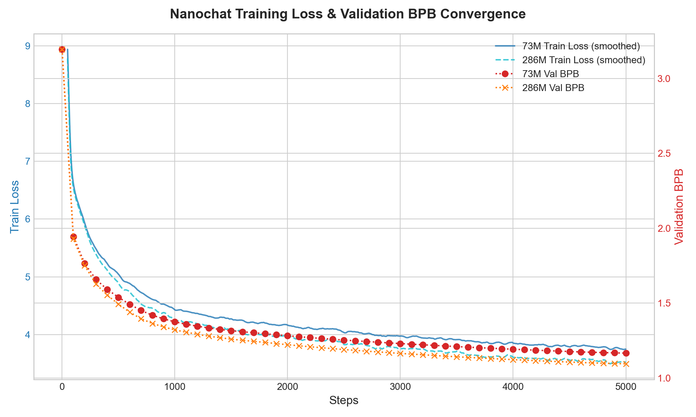
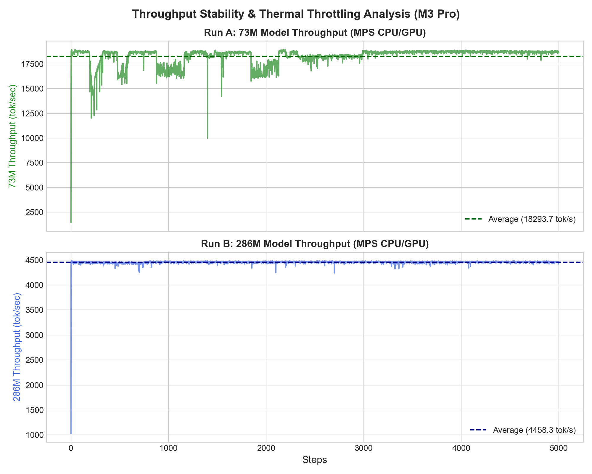
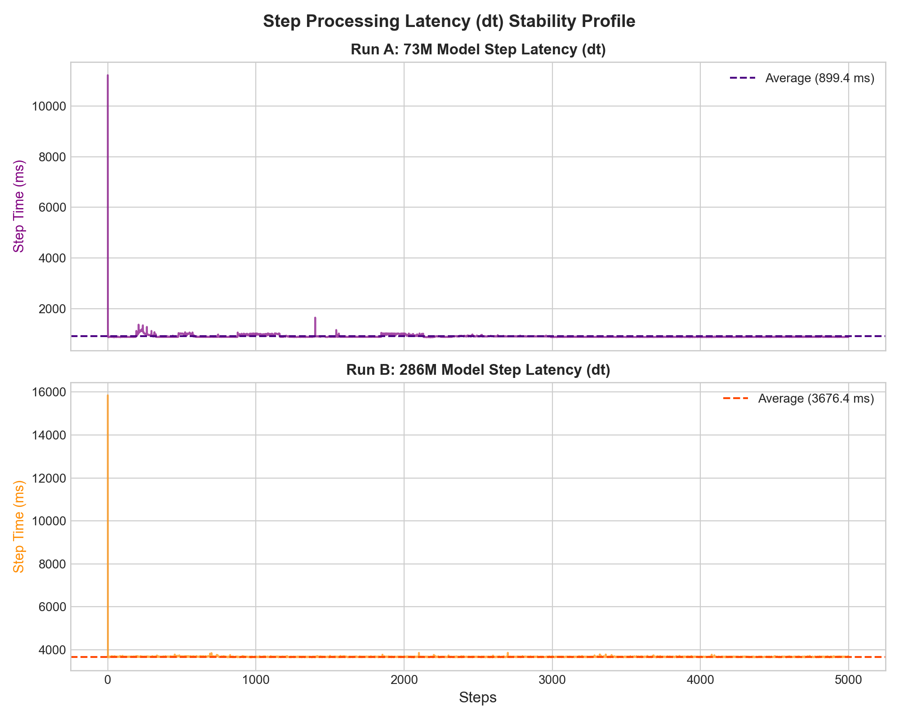

# M3 Pro Nanochat Baseline Experiment Report

This experiment documents the baseline training speed and validation performance of Karpathy's [`nanochat`](https://github.com/karpathy/nanochat) on an Apple M3 Pro CPU/GPU (MPS backend) across two model scales.

---

## Executive Summary

| Phase / Model Scale | Parameters | Duration (minutes) | Avg Throughput (tok/sec) | Final Validation BPB | Peak Memory (GB) |
| :--- | :--- | :--- | :--- | :--- | :--- |
| **Tokenizer Training** | N/A | 0.82m (49.29s) | N/A | N/A | N/A |
| **73M Baseline Model** | 73.5M total | 74.61m | ~18,700 | 1.1664 | < 4 GB |
| **286M Scale-Up Model**| 286.2M total| 305.49m | ~4,470 | 1.0954 | < 8 GB |

*Note: Parameter totals include value-based embeddings (`value_embeds`) specific to the `nanochat` codebase config at these depths, which substantially inflates parameter totals compared to vanilla GPT-2 configurations.*

---

## Performance Insights

### 1. Throughput & Hardware Scaling
*   **73M Model**: Achieved **~18,700 tokens per second** on Apple Silicon MPS.
*   **286M Model**: Achieved **~4,470 tokens per second**.
*   **Scaling Factor**: Increasing model size by **~3.9x** resulted in a **~4.2x** drop in throughput. The scaling remains fairly linear, indicating efficient tensor execution and cache utilization on the unified memory architecture.

### 2. Loss and Convergence
*   The **286M model** achieved a lower validation bits-per-byte (**1.0954**) than the **73M model** (**1.1664**) at the same number of iterations (5,000 steps). This matches standard scaling expectations where larger capacity models learn more efficiently per token.

### 3. Generation Quality Observations
*   **73M Model (at step 5000)**:
    *   *Sample output*: `<|bos|>The capital of France is the capital of the world. The capital of France is the capital of the world`
    *   *Observation*: The model learned basic language syntax but suffered from severe repetition cycles due to its low parameter capacity and short pre-training window.
*   **286M Model (at step 5000)**:
    *   *Sample output*: `<|bos|>The capital of France is the capital of France. The capital of France is the capital of France. The`
    *   *Observation*: Similar repetition behavior but higher structural rigidity. More pretraining iterations are required to break repeating loops.

---

## Hardware Limitations & Bottlenecks
*   **Flash Attention 3 (FA3) Absence**: Both runs triggered warnings that FA3 was unavailable on the platform, falling back to PyTorch's native SDPA. This reduces optimal training speed.
*   **Compute Precision**: Operating under `float32` (default autodetected type for non-CUDA backends in `nanochat`) limits speed. Moving to `float16` or `bfloat16` mixed-precision on Apple Silicon (which has full native support for float16 matrix cores) represents a primary optimization vector for future work.

---

## How to Test the Trained Models

Since these are raw pre-trained base models, they complete prompt text rather than chatting in a conversational template. You can test them using the custom text completion script:

```bash
cd ~/code_projects/nanochat
source .venv/bin/activate

# Test the 73M Baseline Model:
python -m scripts.complete_cli -g d6_baseline

# Test the 286M Scale-Up Model:
python -m scripts.complete_cli -g d12_gpt2_small
```

Enter a prompt (e.g., `There once was a ship that put to sea`) and press Enter to see the model generate raw text completions in real-time. Type `quit` or press `Ctrl+C` to exit.

---

## Performance Plots

### 1. Training and Validation Loss Convergence


### 2. Throughput and Thermal Stability


### 3. Step Latency Profile

