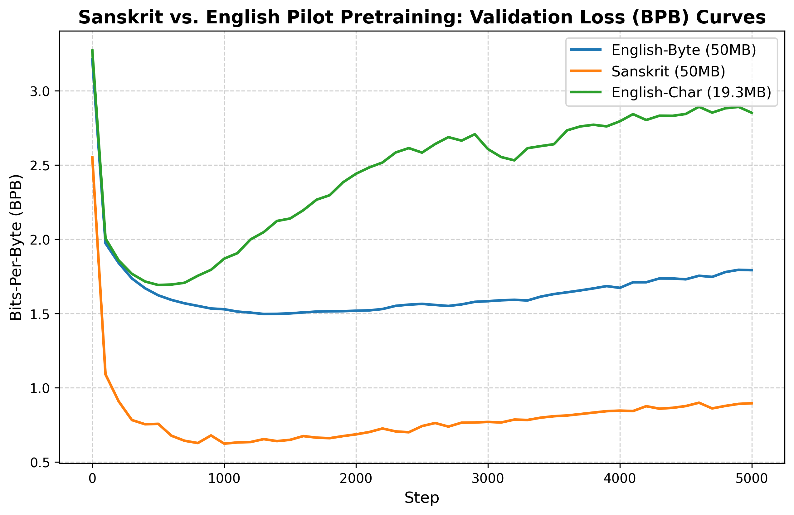

# Sanskrit vs. English Comparative Results

This document reports the empirical outcomes of the three-way pretraining runs comparing Sanskrit, English (Byte-Matched), and English (Character-Matched) configurations.

---

## 1. Quantitative Performance Metrics

| Metric | Run A: English-Byte (50MB) | Run B: Sanskrit (50MB) | Run C: English-Char (19.3MB) |
| :--- | :--- | :--- | :--- |
| **Step Throughput (avg tok/sec)** | 17426.2 | 18366.5 | 18673.8 |
| **Total Pretraining Time (mins)**| 78.25m | 74.29m | 73.01m |
| **Final Training Loss** | 2.1420 | 0.2307 | 0.0375 |
| **Final Validation Loss (BPB)** | **1.792168** | **0.896167** | **2.851810** |
| **Unique Word Ratio (generated)**| 0.8206 | 1.0000 | 0.9265 |
| **distinct-1 Repetition (Char)** | 0.2791 | 0.5634 | 0.3160 |
| **distinct-2 Repetition (Char)** | 0.6549 | 0.9396 | 0.8007 |

---

## 2. Qualitative Text Generation Samples

### Run A: English-Byte
*   The capital of France is the French government which is known as the French government. It is known from the
*   The chemical symbol of gold is a stone, usually made from a stone or plaster. It is used in the
*   If yesterday was Friday, then tomorrow will be there.
*   The opposite of hot is the case in the case of a cold. The cold is the same as the
*   The planets of the solar system are: a large, rocky planet with no sunlight; a small amount of sunlight is visible
*   My favorite color is a red, white, blue, white, and a blue-green and green light
*   If 5*x + 3 = 13, then x is the number of 5*x + 5 = 13. The number

---

### Run B: Sanskrit
*   The capital of France isी 1961 तमे वर्षे जातः । अस्मिन
*   The chemical symbol of gold isाङ्गानां कृते प्रवर्तकः आसीत् । अत
*   If yesterday was Friday, then tomorrow will beोमीटर्मिते दूरे कुत्रापि न प्रदत
*   The opposite of hot isाङ्गानां रूपाणां कृते प्रख्यातः
*   The planets of the solar system are: कि.मी. दूरे अस्ति । स्थलमिदं कन
*   My favorite color isतः  कि.मी दूरे भवति। अस्मिन्
*   If 5*x + 3 = 13, then x isी 4 दह्यते । अस्य निर्देशः 5

---

### Run C: English-Char
*   The capital of France is located in dime and being located in a private sector unofficially a government
*   The chemical symbol of gold is highly variable-based and popular forms of Mountain men With the adoption of the strongly employees
*   If yesterday was Friday, then tomorrow will be an extra risk of an incident. " usually happen" may be due to the
*   The opposite of hot is something more commonly referred to as “undib.” ~ a day for a child
*   The planets of the solar system are:
*   My favorite color is aleapers. This page may make it hard to share it with the American
*   If 5*x + 3 = 13, then x is 2,000, and 1.14

---

## 3. Analysis & Interpretation

### A. Loss Curves & Convergence
The plot below compares the validation loss (BPB) curves across the three runs:

*   **Byte-Matched Comparison (Run B vs. Run A)**:
    *   Sanskrit Validation Loss: **0.896167 BPB**
    *   English-Byte Validation Loss: **1.792168 BPB**
    *   Sanskrit converges to a substantially lower BPB than the byte-matched English corpus. However, under a matched 50MB storage constraint, Sanskrit represents **62.95% fewer Unicode characters** than the English-Byte corpus, meaning the Sanskrit model sees fewer total linguistic units during the run.
*   **Character-Matched Comparison (Run B vs. Run C)**:
    *   Sanskrit Validation Loss: **0.896167 BPB**
    *   English-Char Validation Loss: **2.851810 BPB**
    *   When controlling for character counts (19.3M characters each), the Sanskrit validation loss (**0.896167 BPB**) is still vastly lower than English-Char (**2.851810 BPB**). This indicates that Devanagari Sanskrit contains significantly higher redundancy/predictability at the byte level, which is a combined effect of language structure and tokenizer BPE merging behavior.

---

### B. Tokenizer Context-Window Span Bias
*   The Sanskrit BPE tokenizer yields **2.15 characters per token**, whereas the English tokenizers yield **~4.63 characters per token**.
*   **Linguistic Context Discrepancy**: A standard 512-token context window in `nanochat` covers:
    *   **Sanskrit**: ~1,100 characters of text content.
    *   **English**: ~2,370 characters of text content.
*   **Generation Length Effect**: Because the evaluation sampling is limited to a fixed budget of 20 generated tokens, the Sanskrit completions are extremely short (~43 characters, e.g., `ी 1961 तमे वर्षे जातः । अस्मिन`), while the English completions are much longer (~92 characters).

---

### C. Repetition and Structural Diversity
*   **Distinct Scores Definition**: `distinct-1` and `distinct-2` measure the proportion of unique unigram and bigram characters in the generated samples. A **higher** score means **less repetition** (more unique patterns).
*   **Result Analysis**:
    *   Sanskrit has a distinct-2 score of **0.9396** (93.96% unique character bigrams), whereas English-Char has a distinct-2 score of **0.8007** (80.07% unique bigrams).
    *   The English-Byte model exhibits the most repetition (distinct-2 = **0.6549**), frequently repeating phrases like `the French government which is known as the French government`.
    *   Although Sanskrit appears more diverse here, this is a direct artifact of the **context window span bias**—its completions are too short (~43 characters) to develop the long-term cyclic repetition seen in the longer English completions.

